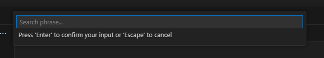

This extension provides two commands:
* Google a phrase - asks you for a search phrase, and launches Google in a new browser tab
* Google the selected phrase - launches Google in a new browser tab, using the currently selected text as the search phrase

